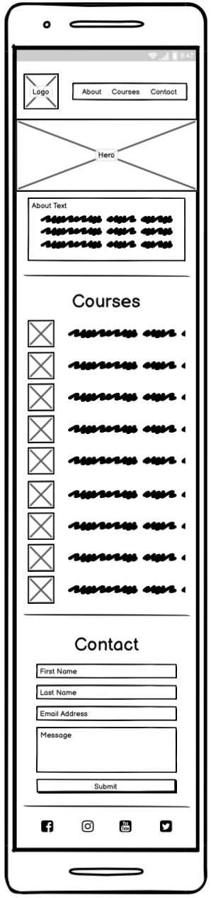

# Hull College

## Introduction

This is a website for potential students to find basic information about Hull College in East Yorkshire, England. 

## UX Design

### User Demographics
The target market are individuals who are wanting to find out more about the college to see if they want to enrol.  It is not for current students.

### User Stories

1. As a potential student, I want to quickly see what courses are offered so I can see if they are of interest.

2. As a potential student, I want to see some general information about the college so I can find out a bit bout it.

3. As a potential student, I want to be able to contact the college so that I can ask any questions I have about the college.

ADD ACCEPTANCE CRITERIA'S?? WATCH https://us02web.zoom.us/rec/play/9FIKllHX2ZiQNFRhYPn_hBh_ZeA8964ZvIDLnhpKGAf1NLVc3_hBJ6zSL8Hv5Hx7ALnPtDmbg8CmFAs.YVsZ9LR_uI7OjEwH

GIVE HAPPY PATH (when user does as expected), and SAD PATH (if put in incorecct info etc and user gets alerted)

TECHNICAL IMPLEMENTATION (how will implement feature, eg, a form will be added with x, x and x required, email must be email etc. user alerted if incoreect input)

### Wireframes

Small screens


Medium sized screens


Large screens


### Design

#### Colour Scheme

Blue was chosen as the main colour for the site.  Research had shown that this is a colour associated with reliability, productivity, trust and order, which are the principles the college wish to promote. 

Coolors.co was then used to find a mix of blues for the main colour platette, with the following decided upon:


The main colours used throughout the website are a mixture of Black and White, with Red accents.

The chosen colour scheme is a reflection of the artist's look and feel.

#### Typography
Typespiration.com was used to find complimenting Google Font pairings, with the following decided upon:

Headings: Roboto Condensed, with a fallback of sans-serif. 
Body: Poppins, with a fallback of sans-serif.

ADD IMG??

## Features

- __Navigation Bar__

 The navigation bar allows the user to easily select which area of the site they wish to view.  It will be located at the top of the site as this is common practice and is the area where most users eyes will be initially drawn to.  It will be 'sticky', meaning it will stay at the top of the users screen even when they scroll the site.  This is because the site is a one page design and it is essential for the user to always be able to navigate the site wherever their current position.  When a link is hovered over it becomes underlined to help the user confirm they are about to select the releavnt link.

The 'hamburger' icon was not used on small screens (where the navigation bar will collapse and be represented as three horizontal lines.  When touched/clicked, this would reveal the navigation in a dropdown menu).    This is often done due to the limited real estate space making the text hard to read when the screen is this size.  However, this design was not used to make the site more easy to navigate for all users.  Furthermore the navigation only contains three links so they have the space to remain next to each other still on small screens without causing accessibility and design issues.

- __Hero Image__

ADD INFO ON IMAGE

- __About Information Box__

A small box containing introductory information is placed below the hero image.  This is eye-catching and quickly confirms to the user that they are on the correct site.  It offers general information on the college so users quickly get a feel for the college.

- __Courses Section__

This section contains images for the courses available at the college so users can quickly see if they offer a course they are interested in.  Icons from Font Awesome are used for the courses to add visual interest and to make each course quickly identifiable and more memorable.

- __Contact Section__

This section allows the user to easily contact the college by using a form to send a message.  The fields are clearly marked, all required and the email field must contain a valid email.  The Submit button is a bright distinctive colour, acting as a call to action for the user.

A map showing the college's location is also included in this section, allowing users to quickly identify where the college is based.

- __Footer__

The footer feature at the bottom of the page contains links to Hull College's social media links.  This will help users find more information.  The links open in a new tab so users are not taken away from Hull College's website.

ADD IMAGES FOR FEATURES.


 


### Features to Implement in the future
- **Merchandise Shop**
     - **Feature** - set up an shop where the artist can sell their merchandise directly to fans online.
     - **Reason for not featuring in this release** - JavaScript needed to implement.
 
 - **[LinkFire](https://www.linkfire.com/ "Link to LinkFire page") embedding**
     - **Feature** - smart-link embedding platform for music promotion
     - **Reason for not featuring in this release** - Budget not available for services

[Back to top ⇧](#Kryan-Live)

## Issues and Bugs 
The developer ran into a number of issues during the development of the websites, with the noteworthy ones listed below, along with solutions or ideas to implement in the future.

white space below image
https://mor10.com/removing-white-space-image-elements-inline-elements-descenders/

page taking long time to load, image size

iframe above sticky nav. change z-index  https://stackoverflow.com/questions/52091989/embedded-iframe-video-overlap-the-fixed-navbar-while-scrolling


[Back to top ⇧](#Kryan-Live)

## Technologies Used
### Main Languages Used
- [HTML5](https://en.wikipedia.org/wiki/HTML5 "Link to HTML Wiki")
- [CSS3](https://en.wikipedia.org/wiki/Cascading_Style_Sheets "Link to CSS Wiki")

### Additional Languages Used
- [JavaScript](https://en.wikipedia.org/wiki/JavaScript "Link to JavaScript Wiki")
     - Used to implement a function that allowed the Navbar to change colour when user scrolls through page on mobile device, for UX purposes.

### Frameworks, Libraries & Programs Used
- [Google Fonts](https://fonts.google.com/ "Link to Google Fonts")
    - Google fonts was used to import the fonts "Roboto", "Lato" and "Montserrat" into the style.css file. These fonts were used throughout the project.
- [Font Awesome](https://fontawesome.com/ "Link to FontAwesome")
     - Font Awesome was used on all pages throughout the website to import icons (e.g. social media icons) for UX purposes.
- [Git](https://git-scm.com/ "Link to Git homepage")
     - Git was used for version control by utilizing the GitPod terminal to commit to Git and push to GitHub.
- [GitHub](https://github.com/ "Link to GitHub")
     - GitHub was used to store the project after pushing
- [Balsamiq](https://balsamiq.cloud// "Link to Balsamiq homepage")
     - Figma was used to create the wireframes during the design phase of the project.
- [Am I Responsive?](http://ami.responsivedesign.is/# "Link to Am I Responsive Homepage")
     - Am I Responsive was used in order to see responsive design throughout the process and to generate mockup imagery to be used.

[Back to top ⇧](#Kryan-Live)

## Testing

Testing information can be found in a separate testing [file](TESTING.md "Link to testing file")

## Deployment

This project was developed using [Visual Studio Code Insiders](https://code.visualstudio.com/insiders/ "Link to Visual Studio Code site"), committed to git and pushed to GitHub using the computer terminal.

### Deploying on GitHub Pages
To deploy this page to GitHub Pages from its GitHub repository, the following steps were taken:

1. Log into [GitHub](https://github.com/login "Link to GitHub login page") or [create an account](https://github.com/join "Link to GitHub create account page").
2. Locate the [GitHub Repository](https://github.com/rebeccatraceyt/KryanLive "Link to GitHub Repo").
3. At the top of the repository, select Settings from the menu items.
4. Scroll down the Settings page to the "GitHub Pages" section.
5. Under "Source" click the drop-down menu labelled "None" and select "Master Branch".
6. Upon selection, the page will automatically refresh meaning that the website is now deployed.
7. Scroll back down to the "GitHub Pages" section to retrieve the deployed link.
8. At the time of submitting this Milestone project the Development Branch and Master Branch are identical.

### Forking the Repository
By forking the GitHub Repository we make a copy of the original repository on our GitHub account to view and/or make changes without affecting the original repository by using the following steps...

1. Log into [GitHub](https://github.com/login "Link to GitHub login page") or [create an account](https://github.com/join "Link to GitHub create account page").
2. Locate the [GitHub Repository](https://github.com/rebeccatraceyt/KryanLive "Link to GitHub Repo").
3. At the top of the repository, on the right side of the page, select "Fork"
4. You should now have a copy of the original repository in your GitHub account.

### Creating a Clone
How to run this project locally:
1. Install the [GitPod Browser](https://www.gitpod.io/docs/browser-extension/ "Link to Gitpod Browser extension download") Extension for Chrome.
2. After installation, restart the browser.
3. Log into [GitHub](https://github.com/login "Link to GitHub login page") or [create an account](https://github.com/join "Link to GitHub create account page").
2. Locate the [GitHub Repository](https://github.com/rebeccatraceyt/KryanLive "Link to GitHub Repo").
5. Click the green "GitPod" button in the top right corner of the repository.
This will trigger a new gitPod workspace to be created from the code in github where you can work locally.

How to run this project within a local IDE, such as VSCode:

1. Log into [GitHub](https://github.com/login "Link to GitHub login page") or [create an account](https://github.com/join "Link to GitHub create account page").
2. Locate the [GitHub Repository](https://github.com/rebeccatraceyt/KryanLive "Link to GitHub Repo").
3. Under the repository name, click "Clone or download".
4. In the Clone with HTTPs section, copy the clone URL for the repository.
5. In your local IDE open the terminal.
6. Change the current working directory to the location where you want the cloned directory to be made.
7. Type 'git clone', and then paste the URL you copied in Step 3.
```
git clone https://github.com/USERNAME/REPOSITORY
```
8. Press Enter. Your local clone will be created.

Further reading and troubleshooting on cloning a repository from GitHub [here](https://docs.github.com/en/free-pro-team@latest/github/creating-cloning-and-archiving-repositories/cloning-a-repository "Link to GitHub troubleshooting")

[Back to top ⇧](#Kryan-Live)

## Credits 

### Content
- The text used in the biographic paragraphs were written by the artist, Ryan Kelly.
- The quote used in the Press Kit page is sourced from [Indie Buddie](https://www.indiebuddie.com/kryan-scars-premiere/ "Link to Indie Buddie").

### Media
- All images were sourced from the artist, Ryan Kelly.
- The text used in the 404 error page was sourced from [CopyAndPasteFonts](https://www.copyandpastefont.com/ "Link to Font editor") and edited by the developer.

### Code 
The developer consulted multiple sites in order to better understand the code they were trying to implement. For code that was copied and edited, the developer made sure to reference this with the code. The following sites were used on a more regular basis:
- [Stack Overflow](https://stackoverflow.com/ "Link to Stack Overflow page")
- [W3Schools](https://www.w3schools.com/ "Link to W3Schools page")
- [Bootstrap](https://getbootstrap.com/ "Link to BootStrap page")
- [JSfiddle](https://jsfiddle.net/ "Link to JSfiddle page")

[Back to top ⇧](#Kryan-Live)

## Acknowledgements

- I would like to thank my friends and family for their valued opinions and critic during the process of design and development.
- I would like to thank my mentor, Seun, for her invaluable help and guidance throughout the process.
- Lastly, I would like to extend my deepest gratitude to Ryan for trusting me in designing this site for him.

[Back to top ⇧](#Kryan-Live)

***
