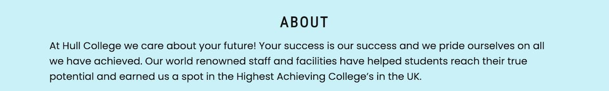
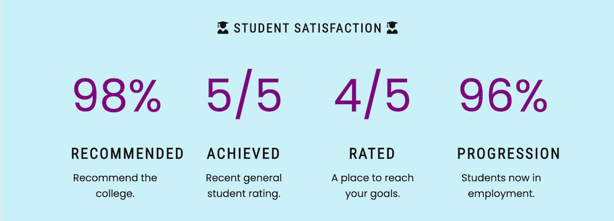
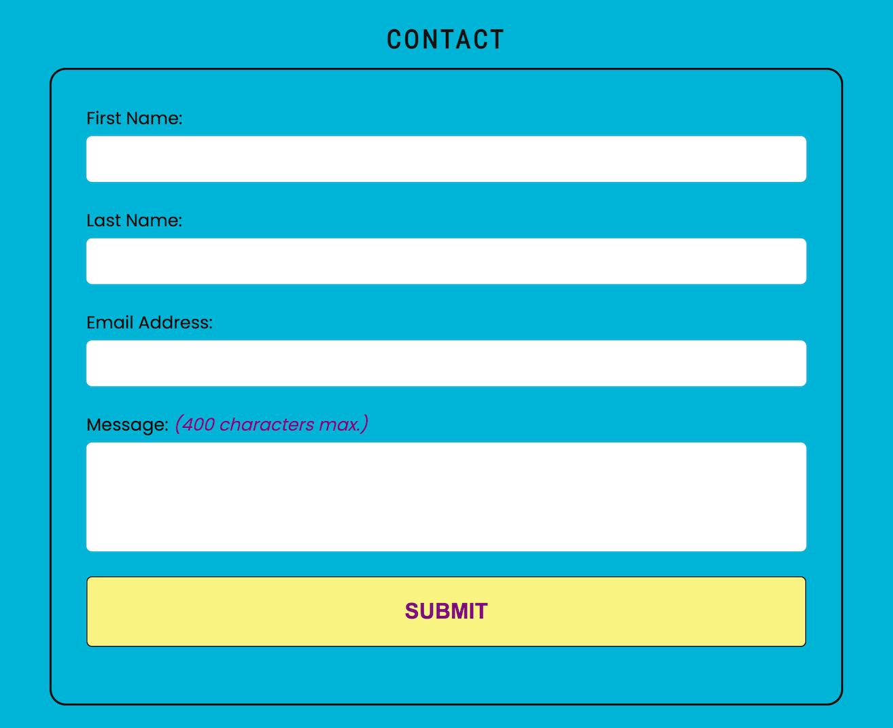

# Hull College Testing

[Main README file](/README.md)

[View live project](https://mjjstockman.github.io/hull-college)

***

# Table of Contents

1. [Testing User Stories](#Testing-User-Stories)
2. [Manual Testing](#Manual-Testing)
   - [Checking Responsiveness](#Checking-the-Responsiveness)
   - [Browser Validation](#Browser-Validation)
3. [Automated Testing](#Automated-Testing)
   - [Code Validation](#Code-Validation)
   - [Lighthouse Auditing](#Lighthouse-Auditing)
4. [User Testing](#User-Testing)
5. [Issues and Bugs](#Issues-and-Bugs)

***

# Testing User Stories

[Back to top ⇧](#Hull-College-Testing)

1. **As a potential student, I want to quickly see what courses are offered, so I can see if they are of interest.**

   - The six courses on offer are clearly listed within the Courses section.
   - Images relating to the subjects are used to draw the users attention.
   - The name of the course is in block capitals and in a different colour the body text to stand out.
   - Icons from Font Awesome are used before and after the courses heading, once again to draw the users attention and make the subjects more memorable.

    

2. **As a potential student, I want to see some general "about" text, so I can confirm that I am on the correct site for my needs.**

   - The about section contains a paragraph of introductory text, letting the user quickly understand the purpose of the site.

    

3. **As a potential student, I want to see facts and figures on student satisfaction, so I can gauge whether I want to enroll.**

   - The about section contains information on the student satisfaction.

    

4. **As a potential student, I want to be able to contact the college so that I can ask any questions I have.**

   - The contact section has a form to send the college a questions/messages.

    

[Back to top ⇧](#Hull-College-Testing)

# Manual Testing

- All links on the site and within its documentation were checked to make sure they are working.

- All form inputs and the textarea were checked to be required by attempting to send the form without an input.

- The email input was checked by attempting to send an invalid email address.

- The maximum length allowed within the Contact message textarea was checked by attempting to enter a message of over 400 characters.

- Manual testing, using [Google Chrome Inspector](https://developer.chrome.com/docs/devtools), identified an issue with the highlighting of the correct navigation links, where they would occasionally not be removed when the area scrolled to is changed.  This was not addressed as it was outside the scope of the project.

## Checking the Responsiveness

[Responsinator](http://www.responsinator.com) was used to check the following responsive features:

- The logo is centered and the navigation drops at a maximum screen width of 689px.

- The navigation links highlights changes at acceptable scroll points.
- All images are displayed at an acceptable size ratio on all screens.
- Images in the Award Winning area change size and positioning at acceptable break points.

***

- Images in the Student Satisfaction area change size and positioning at acceptable break points.

***

- The form and map in the Contact section stack at an acceptable break point.

*Please note the empty box at the bottom displays a map on the deployed site.*

- Spacing changes at acceptable break points.

The following devices and orientation were tested:

| Device            | Orientation | Screen width |
| ----------------- | ----------- | ------------ |
| iPhone X          | portrait    | 375px        |
| iPhone X          | landscape   | 734px        |
| Android (Pixel 2) | portrait    | 412px        |
| Android (Pixel 2) | landscape   | 684px        |
| iPhone 6-8        | portrait    | 375px        |
| iPhone 6-8        | landscape   | 667px        |
| iPhone 6-8 Plus   | portrait    | 375px        |
| iPhone 6-8 Plus   | landscape   | 667px        |
| iPad              | portrait    | 768px        |
| iPad              | landscape   | 1024px       |

[Back to top ⇧](#Hull-College-Testing)

## Browser Validation

The site was tested on the following browsers:

- Chrome
- Safari 
- Opera
- Firefox

# Bugs Found

## Use of AVIF's
The AVIF format was used for all images, in an attempt to reduce file size.  When testing on the above browsers, it was found that the AVIF format is [not yet widely supported](https://caniuse.com/?search=AVIF).

A decision was therefore made to convert the images back to a suitable file format.

# Automated Testing

## Code Validation

### HTML

The [W3C Markup Validator](https://validator.w3.org/) was used to validate the HTML. This detected three warnings relating to only using h1 elements as top-level headings. This was ignored because the use of h1's fitted the design of the site, especially as a one-page design.

### CSS

The [W3C CSS Validator](https://jigsaw.w3.org/css-validator) was used to validate the CSS and no errors were found.  Two warnings were detected, stating:
- Imported style sheets are not checked in direct input and file upload modes.
- -webkit-sticky is an unknown vendor extension

These were not acted upon as they are deemed to be acceptable warnings.

[Back to top ⇧](#Hull-College-Testing)

## Lighthouse Auditing

- Lighthouse was used to audit the site and the report can be found [here](assets/pdf/lighthouse-report.pdf).
- Although useful, no changes were made to improve its ratings as this was outside the scope of this project and its time restrictions.

[Back to top ⇧](#Hull-College-Testing)

# User Testing

Numerous peers and friends helped to review the site and its development, with the following issues found and fixed:

Many thanks to [Matt Boden](https://github.com/MattBCoding) for the following suggestions:

- A favicon was added.

- On iPhone 5/SE (width of 320px) the Font Awesome icon on the right of the Student Satisfaction heading was wrapping beneath the text. This was fixed by reducing the size of all &lt;h2>'s when the design broke. The decision to change all &lt;h2>'s so the design of the site remains consistent.

- The JavaScript used to highlight the active navigation link on scroll wasn't working correctly on an iPad Pro (width of 1440px). This was fixed by adding a media query when the design broke to adjust the scroll-padding-top value.

- The size of the text within the Submit button was capitalised and increased in size.

Many thanks to [Naoise Gaffney](https://www.linkedin.com/in/naoisegaffney/) for the following advice:

- Mismatched quotation marks were used within the head. These were changed.

[Back to top ⇧](#Hull-College-Testing)

# Issues and Bugs

A number of bugs and issues were encountered during the sites development, as detailed below.

Some images had a small amount of white space below them. This is because images are inline elements and therefore treated as text and assumed to have descenders. Research found [here](https://mor10.com/removing-white-space-image-elements-inline-elements-descenders) explains that the white space can be removed by declaring the image as a block level element.

The page was taking a long time to load. This was fixed by reducing the file size of images used. This was initially done using [TinyPNG](https://tinypng.com/), a smart lossy image compression tool and [Squoosh](https://squoosh.app) was used later in development to change all images into AVIF format to further reduce their file size.

The sticky header (with the logo and navigation) initially displayed behind the iframe map. This issue was solved by adding a z-index of 1 to the header. This suggestion was found [here](https://stackoverflow.com/questions/52091989/embedded-iframe-video-overlap-the-fixed-navbar-while-scrolling).

The [HTML Validator](https://validator.w3.org) showed errors for the description and keywords meta tags in the head. This was due to mismatching quotation marks, as seen below:

[Back to top ⇧](#Hull-College-Testing)
